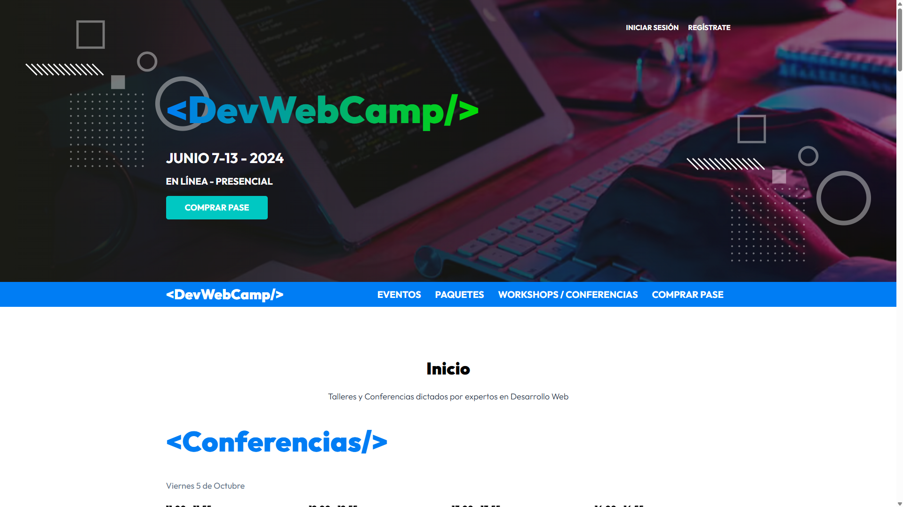

# DevWebCamp

Aplicación web para la gestión de una conferencia de desarrollo web y workshops, desarrollada con PHP y MySQL bajo una arquitectura MVC.

La aplicación permite a los usuarios registrarse, iniciar sesión, recuperar su contraseña, adquirir su pase para el evento, seleccionar conferencias y workshops, y elegir un regalo. Los administradores cuentan con un área de administración para gestionar ponentes, usuarios y contenido relacionado con el evento.

## Tecnologías

* PHP 8
* MySQL
* MySQLi
* JavaScript
* SASS
* Gulp
* Webpack
* Chart.js
* Fetch API
* PHPMailer
* Composer

## Funcionalidades

* Registro y autenticación de usuarios.
* Confirmación de cuentas mediante correo electrónico.
* Recuperación de contraseña.
* Inicio y cierre de sesión.
* Compra de pase para el evento.
* Selección de hasta 5 conferencias y/o workshops.
* Selección de regalo después de completar la selección de eventos.
* Validación de disponibilidad y selección de eventos.
* Visualización de información de conferencias y workshops.
* Gestión de ponentes desde el área administrativa.
* Gestión de usuarios registrados.
* Dashboard administrativo con estadísticas.
* Visualización de estadísticas mediante Chart.js.
* Envío de correos electrónicos mediante PHPMailer.
* Consumo de datos mediante Fetch API.
* Manejo de variables de entorno.
* Procesamiento y optimización de imágenes.
* Generación de formatos WebP y AVIF.
* Diseño responsive.

## Conceptos aplicados

* Arquitectura MVC.
* Programación Orientada a Objetos (POO).
* Patrón Active Record.
* Routing.
* Autoloading mediante PSR-4.
* Namespaces.
* Manejo de sesiones.
* Autenticación y autorización de usuarios.
* Manejo y validación de formularios.
* Consumo de APIs mediante Fetch API.
* Manejo de peticiones HTTP.
* Variables de entorno.
* Envío de correos electrónicos.
* Separación de responsabilidades.
* Consultas a MySQL mediante MySQLi.
* Relaciones entre tablas.
* Manejo de archivos.
* Procesamiento y optimización de imágenes.
* Generación de contenido mediante una herramienta CLI personalizada.
* Automatización de tareas con Gulp.
* Empaquetado de JavaScript con Webpack.

## Herramientas de desarrollo

El proyecto utiliza Gulp como herramienta de automatización para el proceso de desarrollo y construcción de los recursos del frontend.

Entre las tareas automatizadas se encuentran:

* Compilación de archivos SASS.
* Generación de sourcemaps.
* Procesamiento y empaquetado de JavaScript.
* Minificación de JavaScript.
* Optimización de imágenes.
* Conversión de imágenes a WebP.
* Conversión de imágenes a AVIF.
* Observación de cambios durante el desarrollo mediante `watch`.

Webpack se utiliza mediante `webpack-stream` dentro de Gulp para empaquetar el código JavaScript a partir de `src/js/app.js`.

## Generador de código

El proyecto incluye una pequeña herramienta CLI desarrollada en PHP para facilitar la creación de controladores y modelos.

Ejemplo para crear un controlador:

```bash
php make.php controller Ponente
```

También permite utilizar el alias:

```bash
php make.php c Ponente
```

Para crear un modelo:

```bash
php make.php model Ponente
```

O utilizando el alias:

```bash
php make.php m Ponente
```

La herramienta genera automáticamente una estructura base siguiendo la arquitectura del proyecto, reduciendo el trabajo repetitivo al crear nuevos controladores y modelos.

## Instalación

### 1. Clonar el repositorio

```bash
git clone https://github.com/devjmmg/devwebcamp.git

cd devwebcamp
```

### 2. Instalar dependencias de PHP

```bash
composer install
```

### 3. Instalar dependencias de JavaScript

```bash
npm install
```

### 4. Configurar las variables de entorno

Crear un archivo `.env` en la raíz del proyecto tomando como referencia `.env.example`.

Configurar las credenciales de la base de datos, el servidor SMTP y la URL de la aplicación:

```env
DB_HOST=
DB_USER=
DB_PASS=
DB_NAME=
DB_PORT=

EMAIL_HOST=
EMAIL_PORT=
EMAIL_USER=
EMAIL_PASS=

APP_URL=
```

### 5. Configurar la base de datos

Crear una base de datos MySQL y configurar las credenciales correspondientes en el archivo `.env`.

El proyecto incluye un dump de la base de datos:

```bash
devwebcamp.sql
```

Importar este archivo en la base de datos creada para generar las tablas necesarias para el funcionamiento de la aplicación.

### 6. Ejecutar Gulp

Iniciar el proceso de desarrollo para compilar y observar los cambios en los archivos:

```bash
npm run dev
```

### 7. Ejecutar el proyecto

En otra terminal, iniciar el servidor de PHP:

```bash
php -S localhost:3000 -t public
```

La aplicación estará disponible en:

```bash
http://localhost:3000
```

## Demo

[Ver aplicación](https://php-devwebcamp.onrender.com/)

## Autor

Juan Manuel Martínez García

GitHub: [devjmmg](https://github.com/devjmmg)
